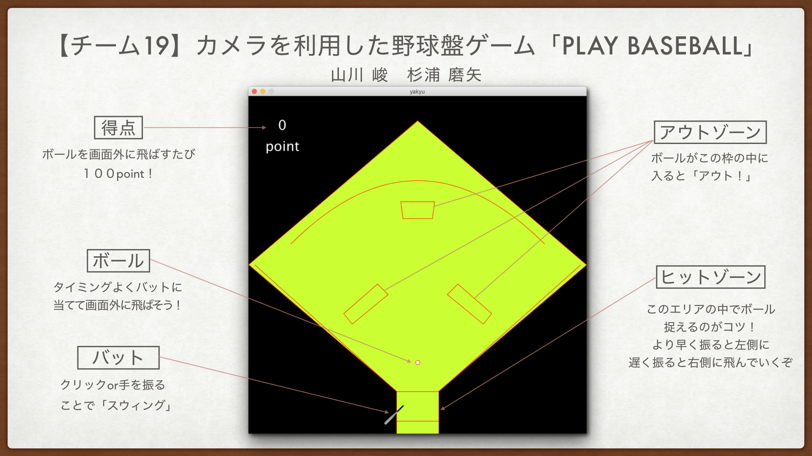

# playbaseball
## 製作者
5418084山川峻  5418023杉浦磨矢

## ゲームの説明
野球盤を模したゲームで来るボールをうまく打ち返すことでポイントを稼いでいくゲームです。

## ゲームの遊び方

## ゲームの流れ
プログラムを始めるとタイトル画面が現れます。画面の指示に従って"z"を押すとゲームを始めることができます。５球ボールを投げ終わるとリザルト画面になります。
リザルト画面からさらに"a"を押すとタイトル画面に戻りリトライすることができます。

## ダウンロード
### [Dawnload_zip](yakyu.zip)

## リンク
### [github](https://github.com/5418084TakashiYamakawa/playplaybaseball)  
### [企画書](plans.pdf)  
### [仕様書](specs.pdf)  
